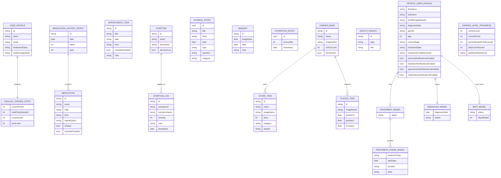
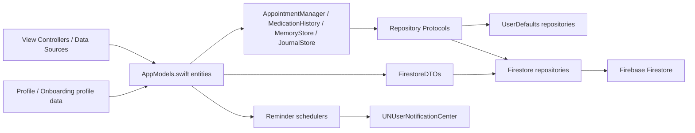
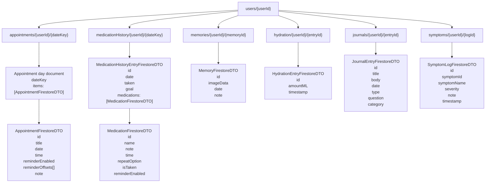
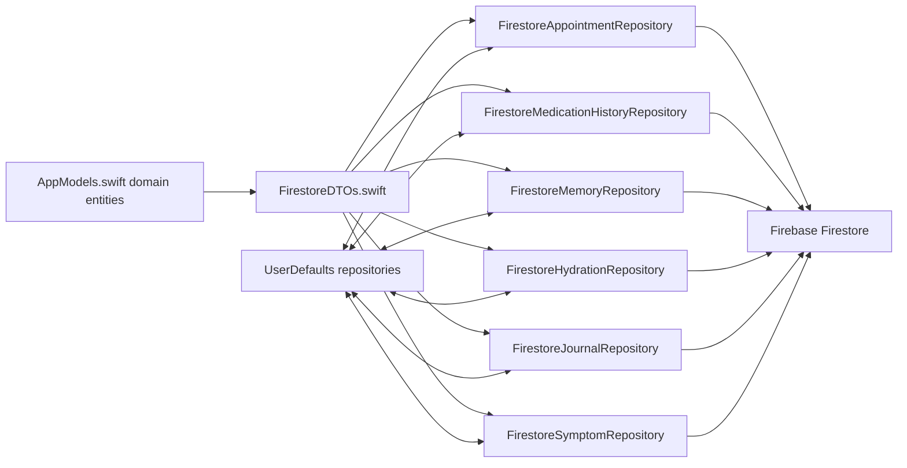

# BreastCancerApp Data Model ERD

This ERD reflects the current project model layout and the profile branch data that still needs to merge cleanly into the app model.

## Entity Relationship Diagram

## Data Flow To Firebase

## Production Boundaries

For a production-ready Firebase integration, keep these boundaries explicit:

- `AppModels.swift`: shared app-domain and reusable feature models only
- `FirestoreDTOs.swift`: Firestore transport and document shapes only
- `Firestore*Repository.swift`: persistence and sync rules only
- feature data sources and controllers: UI-local enums, section types, and presentation helpers

This keeps app models stable while allowing Firestore documents to evolve without leaking storage details into the UI layer.

## Firestore Document Model

This view is closer to how Firebase Firestore actually stores the app data.

## Firestore Sync Mapping

## Notes For NoSQL Interpretation

- `appointments` are grouped by `dateKey`, and each date document embeds many `AppointmentFirestoreDTO` items.
- `medicationHistory` is also grouped by `dateKey`, and each date document embeds many `MedicationFirestoreDTO` items.
- memories, hydration, journals, and symptom logs are effectively document-per-record collections.
- relationships are enforced by app code and repository logic, not by database foreign keys.
- the central role of `AppModels.swift` is to define the app-domain entities; `FirestoreDTOs.swift` defines the Firestore transport shape.

## AppModels.swift alignment

`AppModels.swift` now acts as the central model map for:

- care/home presentation models
- appointments
- medications
- journal
- symptoms
- insights
- memories and hydration
- garden/store entities
- profile/onboarding profile entities
- treatment/diagnosis/wait journey entities

Remaining non-`AppModels.swift` structs/enums in the project are still mostly controller-local, data-source-local, Firestore DTOs, or feature-internal helper types.
